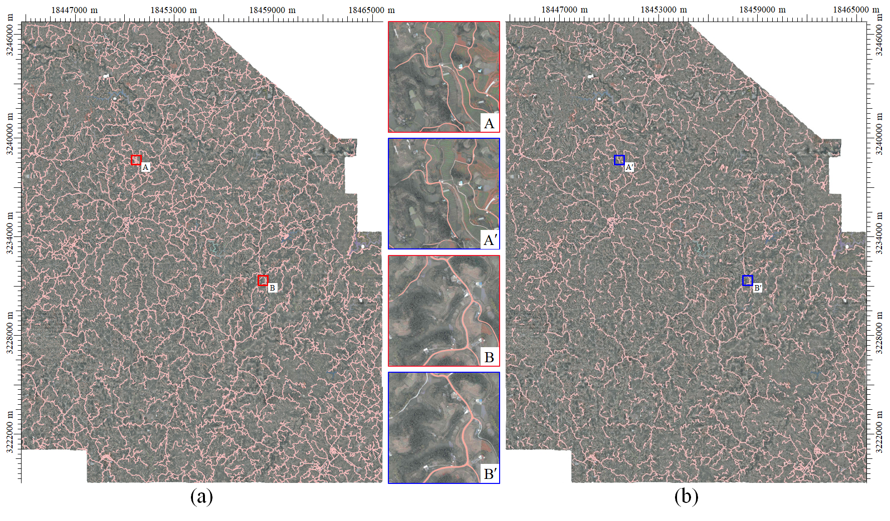

## Abstract

Automatic extraction of high-precision roads from remote sensing images is crucial for path planning and road monitoring. However, there is room to improve the accuracy and generalization of existing methods in segmentation due to the challenges posed by ground object occlusion and complex backgrounds. Most existing methods rely on convolutional neural networks (CNNs), but the limitations of convolution prevent direct semantic interaction at a distance. In contrast, mix-Transformer (MiT) obtains long-term modeling capability through the self-attention mechanism, and inspired by it, we propose a multiscale self-adaptive network [U-shaped MiT network (UMiT-Net)] based on the U-shaped structure. First, UMiT-Net extracts global features with the efficient MiT backbone. Second, the dilated attention module (DAM) is used in the bottleneck of the network to fuse semantic features further to ensure the connectivity of the road. Third, in the decoder, to improve the accuracy of road segmentation, we construct the multiscale self-adaptive module (MSAM), which summarizes rich scene understanding from dense contexts with strip windows conforming to road morphology, and embed an edge enhancement module (EEM) to correct road edges. Finally, we design patch expanding (PE), which solves the problem of heavy computation of upsampling due to high resolution. The experimental results show that our UMiT-Net is substantially ahead of other state-of-the-art methods and has a significant improvement in generalization ability.

## Paper
[UMiT-Net: A U-Shaped Mix-Transformer Network for Extracting Precise Roads Using Remote Sensing Images.](https://ieeexplore.ieee.org/document/10138345)

## Results
### 现场数据


## Cite

### if this work is helpful for you, please cite
```
@ARTICLE{10138345,
  author={Deng, Fei and Luo, Wen and Ni, Yudong and Wang, Xuben and Wang, Yan and Zhang, Gulan},
  journal={IEEE Transactions on Geoscience and Remote Sensing}, 
  title={UMiT-Net: A U-Shaped Mix-Transformer Network for Extracting Precise Roads Using Remote Sensing Images}, 
  year={2023},
  volume={61},
  number={},
  pages={1-13},
  keywords={Roads;Feature extraction;Remote sensing;Semantics;Decoding;Dams;Image edge detection;Mix-Transformer (MiT);remote sensing image;road extraction;semantic segmentation;U-shaped},
  doi={10.1109/TGRS.2023.3281132}}

```