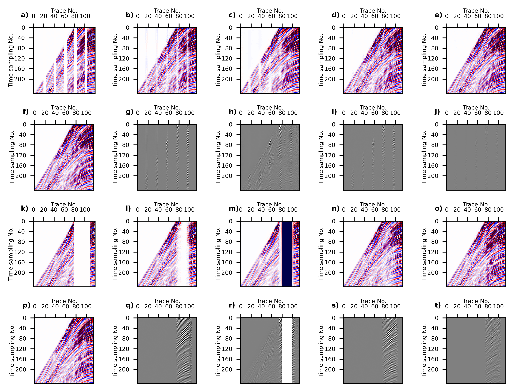

## Abstract

Reconstruction of complete seismic data is a crucial step in seismic data processing, which has seen the application of various convolutional neural networks (CNNs). These CNNs typically establish a direct mapping function between input and output data. In contrast, diffusion models, which learn the feature distribution of the data, have shown promise in enhancing the accuracy and generalization capabilities of predictions by capturing the distribution of output data. However, diffusion models lack constraints based on input data. To use the diffusion model for seismic data interpolation, our study introduces conditional constraints to control the interpolation results of diffusion models based on input data. Furthermore, we improve the sampling process of the diffusion model to ensure higher consistency between the interpolation results and the existing data. Experimental results conducted on synthetic and field datasets demonstrate that our method outperforms existing methods in terms of achieving more accurate interpolation results, with structural similarity (SSIM) outperforming existing methods by 4.1% and signal-to-noise ratio (SNR) by 24%.

## Paper
[Seismic Data Reconstruction Based On Conditional Constraint Diffusion Model.](https://ieeexplore.ieee.org/document/10453526)

## Results
### 现场数据

## Code

### The code implementation is [here.](https://github.com/WAL-l/Reconstruction)

## Cite

### if this work is helpful for you, please cite
```
@ARTICLE{10453526,
  author={Deng, Fei and Wang, Shuang and Wang, Xuben and Fang, Peng},
  journal={IEEE Geoscience and Remote Sensing Letters}, 
  title={Seismic Data Reconstruction Based on Conditional Constraint Diffusion Model}, 
  year={2024},
  volume={21},
  number={},
  pages={1-5},
  keywords={Mathematical models;Data models;Interpolation;Encoding;Vectors;Training;Predictive models;Diffusion model;neural network;seismic data reconstruction},
  doi={10.1109/LGRS.2024.3371675}}
```